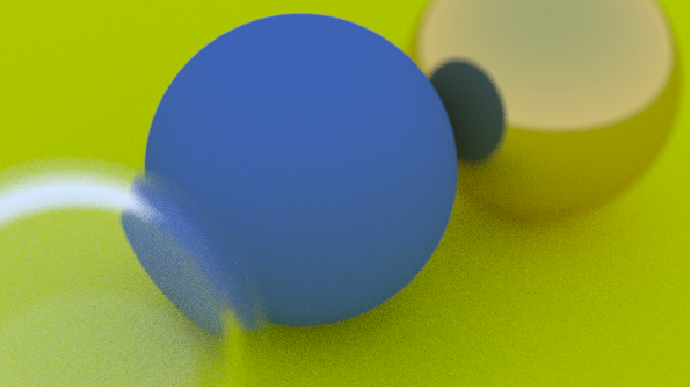

# Ray Tracer

A minimal path‑tracer that demonstrates:
- Indirect lighting  
- Anti‑aliasing  
- Multiple material types (diffuse, metal, dielectric)  
- Depth‑of‑field and camera focus  



**Inspired by** the *Ray Tracing* book series by Peter Shirley, Trevor David Black, and Steve Hollasch:  
<https://github.com/RayTracing/raytracing.github.io/>

---

## Quickstart

```bash
# Clone the repo
git clone https://github.com/carwho/Ray-tracing.git
cd Ray-tracing

# Build
g++ -std=c++17 main.cc -o raytracer

# Render
./raytracer > output.ppm

# View (requires Python + matplotlib)
python3 ppm_viewer.py output.ppm
